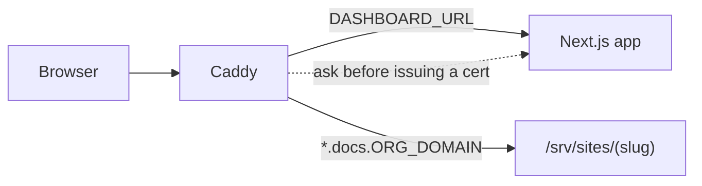

Four moving pieces, one Docker Compose file. Nothing here needs a Kubernetes cluster or a managed database — it's sized to run on a single small VM.

<CardGroup cols={2}>
  <Card title="Caddy">
    Reverse proxy. The only thing with a public IP. Terminates TLS and routes each request to the right place.
  </Card>
  <Card title="Dashboard">
    The Next.js app. Auth, project/member management, GitHub App integration, docs.zip uploads.
  </Card>
  <Card title="Build worker">
    Polls for queued builds, runs the Astro/Starlight build for whichever project changed, writes the output to disk.
  </Card>
  <Card title="Docs sites" icon="open-book">
    Static output per project, served straight off disk — no server-side rendering once a site is built.
  </Card>
</CardGroup>

## Request flow

Every request hits Caddy first. Where it goes from there depends on the hostname:

| Hostname | Routed to | TLS |
| --- | --- | --- |
| `DASHBOARD_URL` (e.g. `docs.example.com`) | The Next.js app, over the internal Docker network | Issued up front — the hostname is known at boot |
| `<slug>.docs.<ORG_DOMAIN>` | Static files for that project, straight off disk | Issued lazily, on the project's first real visit |

The dashboard's own domain is the simple case — Caddy requests a certificate for it automatically, the way any single-domain site would.

Project subdomains aren't known ahead of time — a new one exists the moment an admin creates a project. Caddy handles this with **on-demand TLS**: instead of a fixed list of hostnames to cover, it asks a small endpoint in the dashboard, *"is this hostname real?"*, the first time anyone visits it, and only issues a certificate if the answer is yes.

<Warning>
  Without that check, anyone who pointed DNS at your server would be able to get a free, valid certificate minted through your infrastructure for a domain they don't actually run through Doctor. The check is what keeps on-demand TLS safe to leave on.
</Warning>

That check is a single route — `apps/web/src/app/api/caddy/ask-domain/route.ts` — and it does exactly one thing: strip the project suffix off the requested hostname, look up whether a project with that slug actually exists, and answer yes or no. Everything that decides whether a hostname is legitimate lives in that one route, in the app — Caddy itself stays dumb about projects, members, or anything else in the database.

## Why one wildcard record covers every project

Because every project lives under the same suffix (`*.docs.<ORG_DOMAIN>`), a single DNS record — one wildcard `A` entry pointing at your server — is all that's needed for every project, present and future. Creating a new project never requires a DNS change; the wildcard already covers it, and the certificate for it is requested automatically the first time someone visits.

<Note>
  See [Installation](/getting-started/installation) for the exact DNS records to add, and [Configuration](/getting-started/configuration) for what `ORG_DOMAIN` and `DASHBOARD_URL` control.
</Note>

<Warning>
  This assumes the default `<slug>.docs.<ORG_DOMAIN>` pattern. On a [tunnel deployment](/guides/tunnel-deployment) without wildcard certificate coverage, `DOCS_SUBDOMAIN_SEPARATOR=-` switches every project to `<slug>-docs.<ORG_DOMAIN>` instead — and that pattern can't be wildcarded at all (a wildcard can only ever match one whole label), so each project needs its own exact DNS route.
</Warning>

## Data

<Steps>
  <Step title="One SQLite database">
    Orgs, members, invites, projects, and build history. Written in WAL mode; the whole instance's state lives in one file.
  </Step>
  <Step title="One directory for build output">
    Each project's built docs site is a folder of static files, rebuilt in place on every push or re-upload.
  </Step>
</Steps>

Both live under `DATA_DIR`, the one path every piece — dashboard, migrations, build worker — is configured to agree on.
